# simpTrade - 简易交易系统

A lightweight, modular trading system built with C++ — supporting user management, item trading, credit evaluation, and data persistence.

## 🌟 核心功能
- **用户管理**：注册、登录与用户信息维护（基于 `user_data_manager`）。
- **物品管理**：物品发布、查询、修改与删除（基于 `item_manager`）。
- **信用体系**：用户信用评级与交易信用校验（基于 `credit_system`）。
- **交易流程**：物品购买、交易记录留存与评价提交。
- **数据持久化**：文本文件存储用户、物品、交易等核心数据，支持数据持久化与读取。
- **可视化交互**：简洁 UI 引导操作，降低使用门槛（基于 `ui_manager`）。

## 🛠️ 技术栈
- 开发语言：C++（兼容 C++11 及以上标准）
- 数据存储：纯文本文件（无需数据库依赖）
- 架构设计：模块化分层（UI 层、业务层、数据层分离）
- 测试支持：单元测试覆盖核心业务逻辑

## 📦 快速开始

### 环境要求
- 编译器：支持 C++11 及以上的 GCC、Clang 或 MSVC
- 系统：Windows/macOS/Linux（跨平台兼容）

### 编译与运行
1. 克隆仓库到本地
   ```bash
   git clone https://github.com/your-username/simpTrade.git
   cd simpTrade
   ```
2. 编译项目（以 GCC 为例）
   ```bash
   g++ main.cpp ui_manager.cpp credit_system.cpp data_manager.cpp item_manager.cpp user_data_manager.cpp -o simpTrade
   ```
3. 运行程序
   ```bash
   # Windows
   simpTrade.exe
   # macOS/Linux
   ./simpTrade
   ```

## 📂 项目目录结构
```
simpTrade/
├─ main.cpp               # 程序入口（初始化模块+启动系统）
├─ ui_manager.{h,cpp}     # UI 交互管理（界面展示+用户输入处理）
├─ credit_system.{h,cpp}  # 信用系统（信用评级+交易权限校验）
├─ data_manager.{h,cpp}   # 数据管理（统一读写文本文件）
├─ item_manager.{h,cpp}   # 物品管理（物品CRUD+查询）
├─ user_data_manager.{h,cpp} # 用户管理（用户CRUD+登录验证）
├─ common.h               # 全局常量、工具函数
├─ item.h                 # 物品数据结构定义
├─ user.h                 # 用户数据结构定义
├─ test_credit_system.cpp # 信用系统单元测试
├─ test_purchase.cpp      # 购买流程单元测试
├─ users.txt              # 用户信息存储
├─ items.txt              # 物品信息存储
├─ transactions.txt       # 交易记录存储
├─ reviews.txt            # 交易评价存储
├─ credit_profiles.txt    # 用户信用档案存储
├─ docs/                  # 项目说明文档、截图
└─ README.md              # 项目概览（本文档）
```

## 📋 数据文件说明
| 文件名               | 存储内容                     | 用途                     |
|----------------------|------------------------------|--------------------------|
| `users.txt`          | 用户名、密码、基本信息       | 用户登录与身份验证       |
| `items.txt`          | 物品ID、名称、价格、状态     | 物品展示与交易匹配       |
| `transactions.txt`   | 交易ID、用户ID、物品ID、时间 | 交易记录追溯             |
| `reviews.txt`        | 交易ID、评价内容、评分       | 交易评价管理             |
| `credit_profiles.txt`| 用户ID、信用分数、评级       | 信用系统数据支撑         |

```mermaid
flowchart LR
    %% 层次分组用不同背景颜色
    subgraph UI["UI 用户界面层"]
        style UI fill:#e7f5ff,stroke:#1c7ed6,stroke-width:2px
        ui1["🟦 主菜单"]
        ui2["🟦 登录注册"]
        ui3["🟦 物品管理"]
        ui4["🟦 信用评价"]
        ui5["🟦 搜索界面"]
        ui6["🟦 发布物品"]
        ui7["🟦 交易历史"]
        ui8["🟦 管理后台"]
        uimgr["👩‍💻 UI管理器"]
    end

    subgraph BL["BL 业务逻辑层"]
        style BL fill:#fff9db,stroke:#f59f00,stroke-width:2px
        itemMgr["📦 物品管理器"]
        userMgr["👤 用户管理器"]
        creditSys["🌟 信用系统"]
    end

    subgraph DL["DL 数据管理层"]
        style DL fill:#e6fcf5,stroke:#12b886,stroke-width:2px
        dataMgr["📚 数据管理器"]
        userDataMgr["📋 用户数据管理器"]
        creditDataMgr["🌟 信用数据管理器"]
    end

    subgraph SL["SL 数据存储层"]
        style SL fill:#fff0f6,stroke:#ae3ec9,stroke-width:2px
        items[["📄 items.txt"]]
        users[["📄 users.txt"]]
        tx[["📄 transactions.txt"]]
        reviews[["📄 reviews.txt"]]
        credit[["📄 credit_profiles.txt"]]
    end

    subgraph ML["ML 模型层"]
        style ML fill:#f8f9fa,stroke:#212529,stroke-width:2px
        itemStruct[["📦 Item"]]
        userStruct[["👤 User"]]
        txStruct[["🔄 Transaction"]]
        reviewStruct[["🔍 Review"]]
        creditStruct[["🌟 UserCreditProfile"]]
    end

    %% 连接关系
    ui2 --> userMgr
    ui3 --> itemMgr
    ui4 --> creditSys
    ui5 --> itemMgr
    ui6 --> itemMgr
    ui7 --> creditSys
    ui8 --> userMgr

    itemMgr --> dataMgr
    userMgr --> userDataMgr
    creditSys --> creditDataMgr

    dataMgr --> items
    dataMgr --> tx
    userDataMgr --> users
    creditDataMgr --> reviews
    creditDataMgr --> credit

    items -.-> itemStruct
    users -.-> userStruct
    tx -.-> txStruct
    reviews -.-> reviewStruct
    credit -.-> creditStruct
```




## 🧪 测试运行
项目包含核心功能的单元测试，编译并运行测试文件即可验证逻辑：
```bash
# 测试信用系统
g++ test_credit_system.cpp credit_system.cpp -o test_credit && ./test_credit
# 测试购买流程
g++ test_purchase.cpp item_manager.cpp user_data_manager.cpp credit_system.cpp -o test_purchase && ./test_purchase
```

## 🤝 贡献指南
1. Fork 本仓库
2. 创建特性分支（`git checkout -b feature/xxx`）
3. 提交代码（`git commit -m "add xxx feature"`）
4. 推送分支（`git push origin feature/xxx`）
5. 发起 Pull Request

## 📄 许可证
本项目采用 [MIT License](LICENSE) 开源协议，允许自由使用、修改与分发。

---
